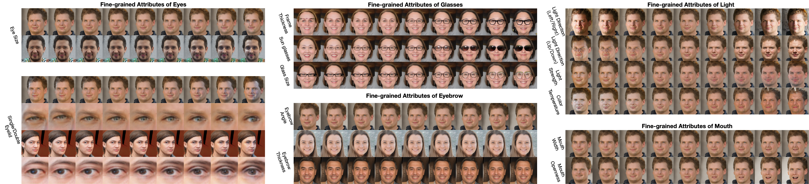
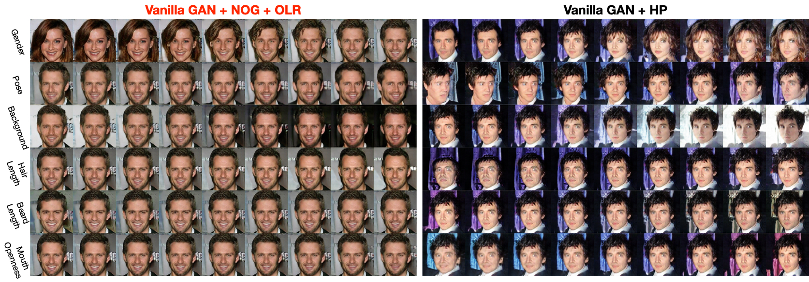

# OrthoImproveCond
ECCV22 paper ["Improving Covariance Conditioning of the SVD Meta-layer by Orthogonality"](https://arxiv.org/pdf/2207.02119.pdf)


We propose [nearest-orthogonal gradient (nog)](https://github.com/KingJamesSong/OrthoImproveCond/blob/main/Decorrelated%20BN/main_cifar100.py#L139) and [optimal learning rate (olr)](https://github.com/KingJamesSong/OrthoImproveCond/blob/main/Decorrelated%20BN/main_cifar100.py#L152) to enforce strict/relaxed orthogonality into the training of differentiable SVD layer, which can simultaneously improve the conditioning and generalization. The combination with [orthogonal convolution](https://github.com/KingJamesSong/OrthoImproveCond/blob/main/Decorrelated%20BN/models/skew_symmetric_conv.py#L12) could further boost the performance.





The proposed orthogonality techniques can be also used for unsupervised latent disentanglement of generative models such as EigenGAN and vanilla/simple GAN. For EigenGAN, we validate our orthogonality techniques on AnimeFace and FFHQ. For vanilla/simple GAN, we conduct experiments on relatively simpler CelebA and LSUN Church.


## Usage (decorrelated BN)

Run decorrelated BN experiments with proposed techniques to improve covariance conditioning:

```python
CUDA_VISIBLE_DEVICES=0 python main_cifar100.py --norm='zcanormbatch' --batch_size=128 --nog --olr --ow
```

## Usage (Orthogonal EigenGAN)

Run orthogonal EigenGAN on FFHQ as:

```python
CUDA_VISIBLE_DEVICES=0 python train_ffhq.py DATA_ROOT  --size 256 --batch 64 --reg_type nog --name ffhq_nog
```

Check (run_ffhq.sh)[https://github.com/KingJamesSong/OrthoImproveCond/blob/main/EigenGAN/run_ffhq.sh] and (run_animeface)[https://github.com/KingJamesSong/OrthoImproveCond/blob/main/EigenGAN/run_animeface.sh] for the detailed training and test commands.

## Usage (Orthogonal vanilla/simple GAN)

All scripts inlcuding training and test can be found in the folder of [training scripts](https://github.com/KingJamesSong/OrthoImproveCond/tree/main/simplegan_experiments/training_scripts). The examplery usage of training orthogonal vannila GAN on CelebA is:

```python
CUDA_VISIBLE_DEVICES=0 python train.py --dataset_mode celeba --model gan128 --nz 30 --reg_type nog --dataroot CELEBA_ROOT --name celeba_nog  
```

For the VP score evaluation, after generating images using [gen_pairs.py](https://github.com/KingJamesSong/OrthoImproveCond/blob/main/simplegan_experiments/gen_pairs.py) please use the official [VP metric](https://github.com/zhuxinqimac/VP-metric-pytorch) to evaluate the disentanglement score. 

## Requirements

Check the environment file [latent.yml](https://github.com/KingJamesSong/OrthoImproveCond/blob/main/latent.yml) for the full list of required packages.

## Citation

Please consider citing our paper if you think the code is helpful to your research.

```
@inproceedings{song2022improving,
  title={Improving Covariance Conditioning of the SVD Meta-layer by Orthogonality},
  author={Song, Yue and Sebe, Nicu and Wang, Wei},
  booktitle={ECCV},
  year={2022}
}
```

## Contact

If you have any questions or suggestions, please feel free to contact me

`yue.song@unitn.it`

